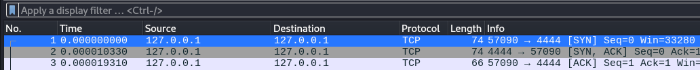

# TCP Nasıl çalışır açıklamasına gelicek olursak transmission control protocol yani geçiş kontrol protokölü
* TCP diğer UDP protokolüne göre daha güvenlidir çünkü paketlerin bütünlüğünü varıp varmadığını kontrol eder eğer ki eksik ya da hatalı bir gönderim olursa veriyi tekrar gönderir
* Ve TCP'de total 6 tane flag(bayraklar) vardır bunlar sırasıyla şunlardır NOT(URG,ECE,CWN) gibi flaglar eklenmemiştir onları kendiniz araştırarak bulabilirsiniz :)
* SYN(Synchronize)
* ACK(Acknowledgement)
* PSH(Push)
* FIN(Finish)
* RST(Reset)

# Ilk bağlantı aşaması Three-Way-Handshake(3'lü el sıkışma)
* 1.AŞAMA: Bağlanmak isteyen istemci sunucuya SYN isteği atar
* 2.AŞAMA: Eğerki ip adresi ve port bilgisi eşleşiyorsa Sunucu istemciye SYN + ACK isteği atar
* 3.AŞAMA: İstemci bu isteğe karşılık ACK Paketi atar
# Aşağıdaki resimde daha açıklayıcı bir şekilde görebilirsiniz

# Evet Sıra geldi veri iletimine SEQ ACK numaralarının işleyişine 
# Burası daha açıklayıcı olucak
* Size bunu daha iyi anlaşılabilir olması için kendi yazdığım araç ve wireshark paket analizi sayesinde daha iyi inceleyebileceğiz.
* İlk Başta SEQ Numarası da ACK numarasıda 1'dir
* diyelim ki sunucu istemciye bir veri attı SEQ Numarası 1: ACK Numarası 1'dir (fakat bu değişiklik gösterebilir)
* İstemci bu veriyi aldığına dair bir ACK cevabı atıcaktır ve bu sefer SEQ = Bir önceki atılan paketin ACK sayısı ACK Sayısı ise bir önceki atılan paketin SEQ numarası + paketin uzunluğu şeklinde olucaktır
#alttaki örnekte daha iyi bir şekilde inceleyebilirsiniz

* İsterseniz kendinizde bunu direkt olarak gözlemleyebilirsiniz
# Ve bağlantı sonlanışına
* Bunu şekilde ele alacağız çünkü 2 şekilde kapanma durumu var
# 1.si Normal sonlanma
* istemci sunucuya FIN  + ACK isteği atar
* sunucu buna karşılık ACK isteği atar
* istemci tekrar FIN + ACK isteği atar
* Sunucu bu isteği alır ve son olarak ACK isteği atar
* ve böylece standart bir sonlanma olur tekrar tekrar atılmasının sebebi eğer ki aktarımı devam eden ya da henüz bitmemiş bir veri akışı varsa bittiğinden emin olup bağlantıyı ona göre sonlandırmaktır
* Bu sonlandırmaya FOUR-WAY-HANDSHAKE denir
* Aşağıdaki resme bakarak daha iyi gözlemleyebilirsiniz..
* https://github.com/dotPEEKs/TryHackMe/blob/main/Networking/TCP/fin_ack.png
* 
# 2.si Ise direkt kapatma ya da sonlandırma
* Bu şekilde hiçbir istek atılmaz sadece RST atılır ve hiçbir cevap beklenmez
