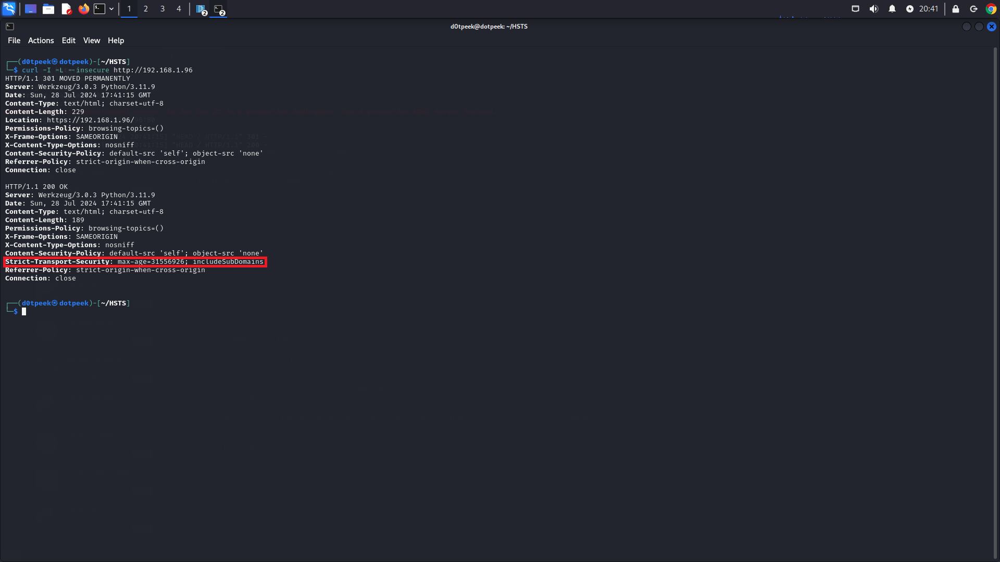

# BU YAZIMIZDA HSTS(HTTP-STRICT-TRANSPORT-SECURITY) NEDIR NASIL ÇALIŞIR ONU ANLATACAĞIZ

## HSTS WEB ALANI İÇİN GELİŞTİRİLMİŞ OLAN BİR GÜVENLİK MEKANİZMASIDIR
* HSTS Sunucunun cevap başlığına eklenir ve tarayıcı bu başlığı aldığında ilgili siteyi HTTPS üzerinden bağlanmaya çalışır fakat her zaman diyemeyiz çünkü bu süre başlık parametresinde yer alan max-age süresine bağlıdır ve minimum 31536000(1YIL) olmalıdır 

* HSTS MITM saldırılarına karşı güçlü bir savunma sağlar çünkü bağlantılar sadece HTTPS üzerinden olacağı için HTTP bağlantılarına izin verilmez böylelilikle aradaki saldırgan verileri ele geçiremez

## Cevap başlığı şu şekilde eklenir:
```Strict-Transport-Security: max-age=31536000; includeSubDomains; preload```
* ```max-age``` bu hsts başlığının süresidir tarayıcı bunu kendi veri tabanında tutar ve vakti dolasıya kadar bağlantıları HTTPS üzerinden yapar ve minimum ```31536000(1 YIL) olmalıdır```
* ```includeSubDomains``` bu özellik sitenin bütün alt domainleri için HSTS uygular ve yapılması önerilir
* ```preload``` bunu anlamak için HSTS nasıl çalışıyor onu bilmemiz gerekiyor ki o da şöyledir tarayıcı ilk HSTS özellikli bir siteye bağlandığında bağlantısını HTTP üzerinden yapar ve sonra HSTS başlığını gördüğünde bu ve bundan sonraki bağlantıları HTTPS üzerinden yapmaya zorlar işte bu özellik bu açığı kapatmak için işe yarıyor preload yaptığınızda ilk bağlantı bile olsa HTTPS üzerinden olucak ve böylece bir güvenlik açığı teşkil etmeyecektir fakat bu özelliği kullanabilmeniz için HSTS preload listesine başvurmanız gerekir başvurmak için [buraya](https://hstspreload.org) gidebilirsiniz
# Aşağıdaki örnekle bunu çok daha iyi gözlemleyebileceğiz 
* öncelikle Flask ile yazdığımız sunucumuzu başlatalım ```python3 hsts.py```
* Ne yazık ki SSL sertifikamız olmadığı için standart ```adhoc``` ssl sertifikasını kullanacağız
* Sizde kendiniz gözlemlemek isterseniz ```curl -I -L --insecure http://192.168.1.96``` komutunu yazabilirsiniz
* [Aşağıdaki](./hsts.png) fotoğraftada görüldüğüz üzere HSTS başlığı eklenmiş durumda :)
* 
